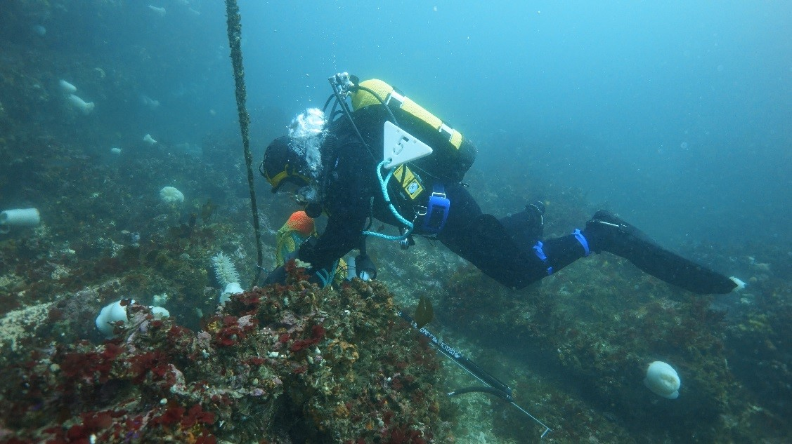
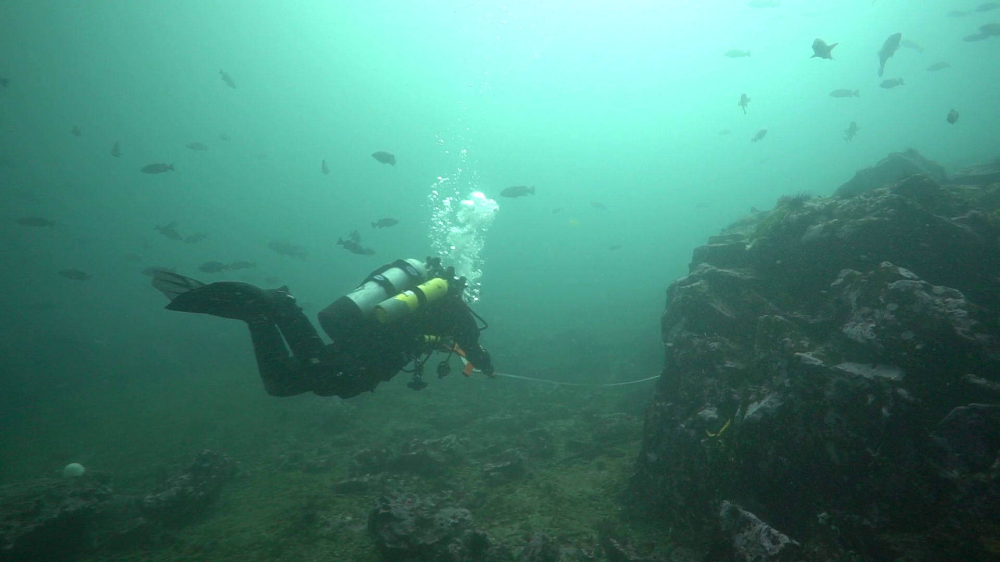
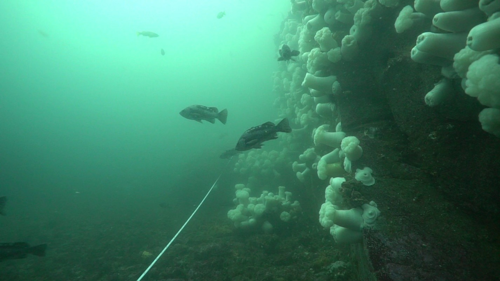
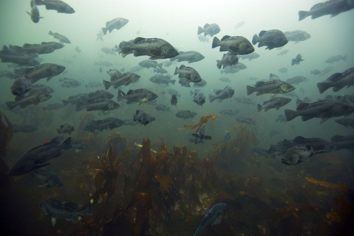
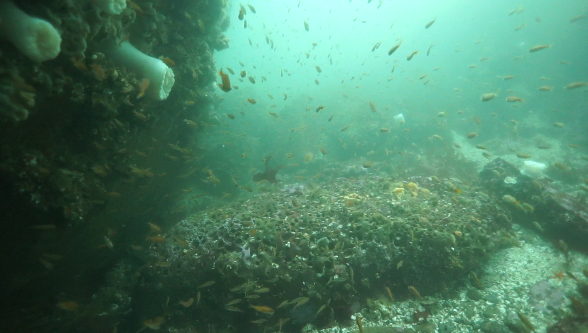
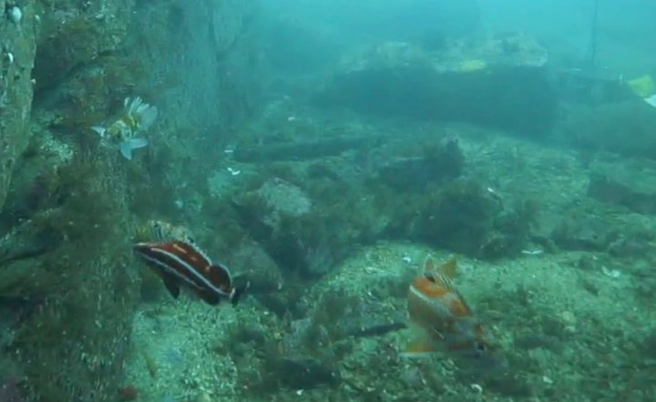

# Seattle Aquarium Neah Bay subtidal monitoring
This repository provides a home for all data, code, and figures associated with the Seattle Aquarium's Neah Bay subtidal rockfish monitoring program.

This research was published in Frontiers in Marine Science in February 2025, in an open-source article titled: [Rockfish abundance, recruitment, and community structure trends in the western Strait of Juan de Fuca, Washington, 2005-2023](https://www.frontiersin.org/journals/marine-science/articles/10.3389/fmars.2025.1452991/full?utm_source=email-sig&utm_medium=email&utm_content=100_VIEWS&utm_campaign=imp_mile_2024_fall_en_aut-ww)

  
   

  
   

  
   

